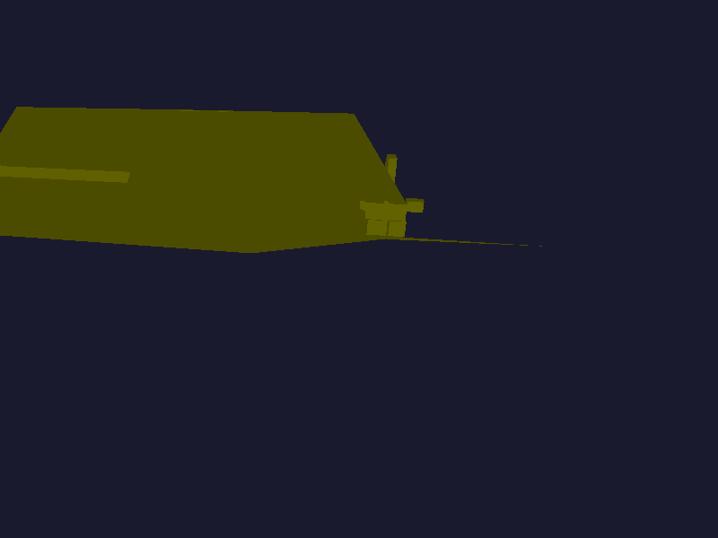
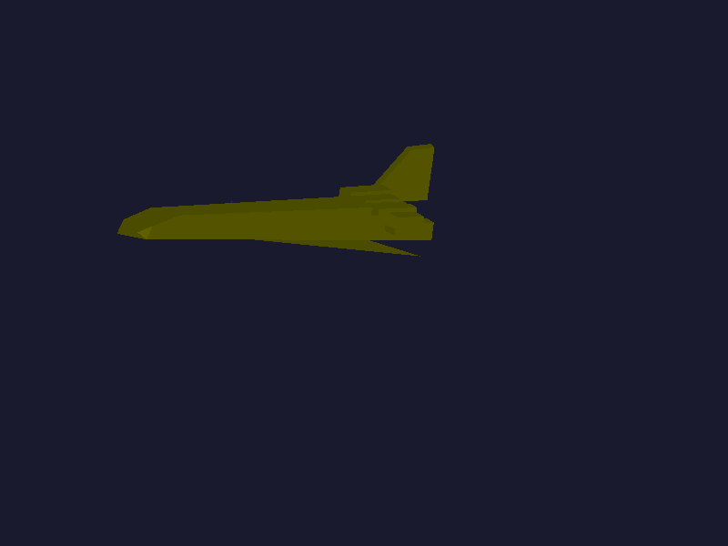

# Sistema Solar - 3D Software Renderer

A from-scratch 3D software renderer implemented in Rust, capable of loading and visualizing .obj models with lighting, 3D transformations, and interactive controls.





*Spaceship rendered with dynamic lighting*

## Features

- **3D Model Rendering**: Load and visualize .obj files
- **Lighting System**: Directional lighting with ambient light component
- **Interactive Controls**: Rotation, translation, scale, and camera zoom
- **Z-buffering**: Proper depth handling for correct occlusion
- **Backface Culling**: Performance optimization
- **Complete Graphics Pipeline**: Vertex shader, rasterization, and fragment processing

## Technologies

- **Language**: Rust
- **Graphics Library**: minifb (software rendering)
- **Mathematics**: nalgebra-glm (matrices and vectors)
- **Model Loading**: tobj (.obj file parser)

## Requirements

- Rust 1.70 or higher
- Cargo

## Installation

1. Clone the repository:
```bash
git clone https://github.com/your-username/SistemaSolar.git
cd SistemaSolar
```

2. Ensure your model is in the correct folder:
```
SistemaSolar/
├── assets/
│   └── Nave.obj
├── src/
└── Cargo.toml
```

3. Build and run (release mode recommended for performance):
```bash
cargo run --release
```

## Controls

| Key | Action |
|-----|--------|
| **Arrow Keys** | Move the spaceship |
| **A / S** | Decrease / Increase model scale |
| **Z / X** | Zoom in / Zoom out camera |
| **Q / W** | Rotate on X axis |
| **E / R** | Rotate on Y axis |
| **T / Y** | Rotate on Z axis |
| **SPACE** | Toggle automatic rotation |
| **ESC** | Exit |

## Project Structure

```
SistemaSolar/
├── src/
│   ├── main.rs           # Entry point and main loop
│   ├── color.rs          # RGB color system
│   ├── fragment.rs       # Fragment structure
│   ├── framebuffer.rs    # Pixel buffer and Z-buffer
│   ├── line.rs           # Line drawing algorithm
│   ├── obj.rs            # .obj file loader
│   ├── shaders.rs        # Vertex shader
│   ├── triangle.rs       # Triangle rasterization
│   └── vertex.rs         # Vertex structure
├── assets/
│   └── Nave.obj          # 3D model
└── Cargo.toml
```

## Customization

### Changing the Spaceship Color

In `main.rs`, modify the line:
```rust
let ship_color = Color::new(255, 255, 0); // RGB
```

Examples:
- Red: `Color::new(255, 0, 0)`
- Blue: `Color::new(0, 0, 255)`
- Green: `Color::new(0, 255, 0)`
- Cyan: `Color::new(0, 255, 255)`

### Changing the Background

```rust
framebuffer.set_background_color(0x1a1a2e); // Hexadecimal format
```

### Loading Another Model

```rust
let obj = Obj::load("assets/your_model.obj").expect("Failed to load model");
```

## Dependencies

```toml
[dependencies]
minifb = "0.26.0"
nalgebra-glm = "0.18.0"
tobj = "4.0.2"
```

## Performance

- **Average FPS**: 30-60 FPS (depends on hardware and model complexity)
- **Supported Triangles**: Up to 5000 per frame
- **Resolution**: 800x600 (configurable)

**Note**: Always compile with `--release` flag for optimal performance.

## Graphics Pipeline

1. **Vertex Shader**: Vertex transformation (model, view, projection)
2. **Primitive Assembly**: Triangle assembly
3. **Rasterization**: Fragment generation using barycentric coordinates
4. **Fragment Processing**: Color and lighting application
5. **Z-buffering**: Depth testing
6. **Frame Buffer**: Final output to screen

## Troubleshooting

### Program Runs Slowly
- Ensure compilation with `cargo run --release`
- Reduce framebuffer resolution in `main.rs`
- Simplify the 3D model if it has too many polygons

### Model Not Visible
- Adjust scale using **A/S** keys
- Adjust zoom using **Z/X** keys
- Verify the .obj file is located at `assets/Nave.obj`

### Error Loading Model
- Verify the .obj file path
- Ensure the format is compatible (triangulated)
