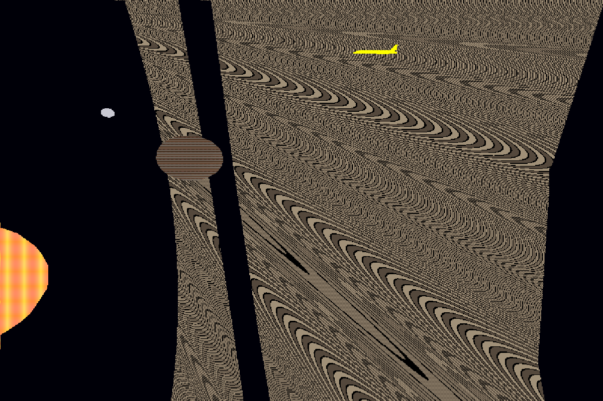
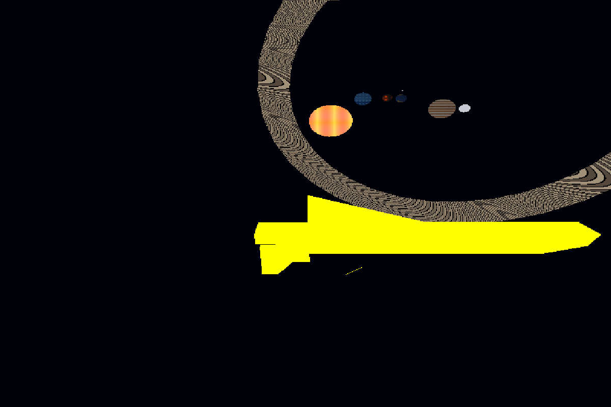

# Solar System - 3D Software Renderer

A comprehensive 3D software renderer implemented in Rust from scratch, featuring a complete solar system simulation with realistic celestial bodies, advanced shader systems, and interactive spaceship navigation.





## Overview

This project is a from-scratch 3D rendering engine built entirely in Rust, demonstrating advanced computer graphics techniques including custom shader implementation, Z-buffering, and real-time rendering of multiple celestial bodies with physically-inspired orbital mechanics.

## Features

### Rendering Engine
- **Complete 3D Pipeline**: Custom implementation of vertex transformation, rasterization, and fragment processing
- **Z-Buffer Depth Testing**: Proper depth handling for correct occlusion
- **Backface Culling**: Automatic removal of non-visible triangles
- **Frustum Culling**: Performance optimization through viewport clipping
- **OBJ Model Loading**: Support for loading and rendering .obj format 3D models

### Celestial Bodies & Shaders
- **Sun Shader**: Animated surface with procedural noise and emission
- **Rocky Planets**: Earth-like and volcanic planet shaders with terrain variation
- **Gas Giants**: Jupiter and Neptune-style atmospheric shaders with dynamic bands
- **Dwarf Planet**: Pluto-style icy surface with crater simulation
- **Moons**: Orbital mechanics with crater-filled surfaces
- **Planetary Rings**: Semi-transparent ring systems with gap simulation
- **Spaceship**: Controllable spacecraft with custom navigation

### Orbital Mechanics
- **Elliptical Orbits**: Realistic orbital paths with configurable eccentricity
- **Multiple Bodies**: Simultaneous rendering of sun, planets, moons, and rings
- **Time-Based Animation**: Dynamic rotation and orbit progression

### Camera System
- **Orbital Camera**: Automatic rotation around the solar system center
- **Follow Camera**: Dynamic tracking of spaceship position
- **Free Camera**: Manual camera control for exploration
- **Smooth Transitions**: Seamless switching between camera modes

### Interactive Controls
- **Spaceship Navigation**: Full 6-DOF movement and rotation
- **Camera Modes**: Three distinct viewing perspectives
- **Real-Time Adjustments**: Dynamic control over camera parameters

## Technical Specifications

### Architecture
- **Language**: Rust (Edition 2021)
- **Rendering**: Software rasterization (no GPU acceleration)
- **Mathematics**: nalgebra-glm for matrix and vector operations
- **Window Management**: minifb for cross-platform window creation
- **Model Loading**: tobj for OBJ file parsing

### Performance Characteristics
- **Target Frame Rate**: 30-60 FPS
- **Resolution**: 800x600 (configurable)
- **Triangle Budget**: 
  - Sun: 1000 triangles/frame
  - Gas Giants: 800 triangles/frame
  - Rocky Planets: 600 triangles/frame
  - Spaceship: 500 triangles/frame
  - Moons: 300 triangles/frame
  - Rings: 400 triangles/frame

### Rendering Pipeline
1. **Vertex Shader**: Applies model-view-projection transformations
2. **Primitive Assembly**: Organizes vertices into triangles
3. **Backface Culling**: Removes triangles facing away from camera
4. **Frustum Culling**: Clips geometry outside viewport
5. **Rasterization**: Converts triangles to fragments using barycentric coordinates
6. **Fragment Shader**: Applies per-pixel lighting and material properties
7. **Z-Buffering**: Resolves depth conflicts
8. **Framebuffer Output**: Writes final pixels to display buffer

## Requirements

- Rust 1.70 or higher
- Cargo package manager
- 3D model files (included in assets/)

## Installation

1. Clone the repository:
```bash
git clone https://github.com/0liRem/SistemaSolar
cd SistemaSolar
```

2. Verify asset structure:
```
SistemaSolar/
├── assets/
│   ├── esfera.obj      # Sphere model for planets
│   ├── Nave.obj        # Spaceship model
│   ├── luna.obj        # Moon model
│   └── anillo.obj      # Ring model
├── src/
└── Cargo.toml
```

3. Build and run (release mode strongly recommended):
```bash
cargo run --release
```

## Controls

### Spaceship Navigation
| Key | Action |
|-----|--------|
| **W** | Move forward |
| **S** | Move backward |
| **A** | Strafe left |
| **D** | Strafe right |
| **Q** | Rotate left |
| **E** | Rotate right |
| **V** | Instant Warp |

### Camera Controls
| Key | Action |
|-----|--------|
| **1** | Orbital camera mode |
| **2** | Follow spaceship mode |
| **3** | Free camera mode |
| **+** | Increase orbital speed |
| **-** | Decrease orbital speed |
| **Arrow Up** | Increase camera height (free mode) |
| **Arrow Down** | Decrease camera height (free mode) |
| **Arrow Left** | Decrease camera distance (free mode) |
| **Arrow Right** | Increase camera distance (free mode) |

### General
| Key | Action |
|-----|--------|
| **ESC** | Exit application |

## Project Structure

```
SistemaSolar/
├── src/
│   ├── main.rs           # Application entry point and main loop
│   ├── color.rs          # RGB color system with operations
│   ├── fragment.rs       # Fragment structure for rasterization
│   ├── framebuffer.rs    # Pixel buffer and Z-buffer management
│   ├── line.rs           # Bresenham line drawing algorithm
│   ├── obj.rs            # OBJ file loader and parser
│   ├── shaders.rs        # Vertex and fragment shaders
│   ├── triangle.rs       # Triangle rasterization with barycentric coordinates
│   └── vertex.rs         # Vertex structure with transformations
├── assets/
│   ├── esfera.obj        # Sphere mesh for celestial bodies
│   ├── Nave.obj          # Spaceship model
│   ├── luna.obj          # Moon surface model
│   └── anillo.obj        # Planetary ring geometry
└── Cargo.toml            # Project dependencies and configuration
```

## Shader System

### Vertex Shader
Transforms vertices from object space to screen space:
- Model transformation (translation, rotation, scale)
- View transformation (camera positioning)
- Projection transformation (perspective)
- Viewport transformation (screen coordinates)
- Normal transformation (lighting calculations)

### Fragment Shaders

#### Sun Shader
- Procedural noise for surface variation
- Animated convection patterns
- High emission values for bright appearance
- Color gradient from yellow to orange-red

#### Rocky Planet Shader (Earth-like)
- Terrain classification (oceans, land, mountains)
- Multi-octave noise for realistic continents
- Directional lighting with ambient component
- Color variation based on elevation

#### Volcanic Planet Shader (Venus-like)
- Lava flow simulation with emission
- Hot rock and cooled rock regions
- High contrast between active and dormant areas
- Self-illumination for molten areas

#### Gas Giant Shaders
- **Jupiter**: Horizontal bands with turbulence, storm systems
- **Neptune**: Smooth atmospheric layers, subtle cloud patterns
- Animated band movement
- Depth-based color variation

#### Dwarf Planet Shader (Pluto-like)
- Icy surface with high reflectivity
- Crater impact simulation
- Gray-white color palette
- High contrast features

#### Moon Shader
- Heavy cratering with varying sizes
- Grayscale color scheme
- Strong directional lighting
- Surface roughness simulation

#### Ring Shader
- Concentric band structure
- Gap simulation (Cassini Division style)
- Semi-transparency effects
- Distance-based color falloff

## Celestial Bodies

### Current Solar System Configuration

| Body | Type | Orbit Radius | Orbit Speed | Scale | Features |
|------|------|--------------|-------------|-------|----------|
| Sun | Star | 0.0 | 0.0 | 20.0 | Emission, animated surface |
| Venus | Rocky | 60.0 | 1.5 | 4.5 | Volcanic, hot atmosphere |
| Earth | Rocky | 80.0 | 1.0 | 5.0 | Oceans, continents, moon |
| Jupiter | Gas Giant | 150.0 | 0.5 | 12.0 | Bands, storms, rings |
| Neptune | Gas Giant | 200.0 | 0.3 | 10.0 | Atmospheric layers |
| Pluto | Dwarf | 250.0 | 0.2 | 3.0 | Icy surface, craters |

## Customization

### Modifying Celestial Body Properties

Edit the celestial body initialization in `main.rs`:

```rust
let mut earth = CelestialBody::new(
    CelestialBodyType::RockyPlanet1,
    80.0,   // orbit_radius
    1.0,    // orbit_speed
    5.0,    // scale
    2.0     // rotation_speed
);
earth.has_moons = true;
earth.has_rings = false;
```

### Creating Custom Shaders

Add a new shader function in `shaders.rs`:

```rust
pub fn custom_planet_shader(
    fragment: &Fragment, 
    uniforms: &Uniforms, 
    normal: Vec3
) -> Color {
    // Your custom shader logic here
    let base_color = Color::new(r, g, b);
    
    // Apply lighting
    let light_dir = Vec3::new(-1.0, -1.0, -1.0).normalize();
    let intensity = dot(&normal, &light_dir).max(0.0);
    
    base_color * (ambient + intensity * diffuse)
}
```

### Adjusting Camera Parameters

Modify camera initialization in `main.rs`:

```rust
let mut camera = Camera::new();
camera.distance = 150.0;    // Distance from center
camera.height = 75.0;       // Camera elevation
camera.orbit_speed = 0.3;   // Orbital rotation speed
```

### Changing Background Color

```rust
framebuffer.set_background_color(0x000008); // Dark space blue
// Or try:
// 0x000000  // Pure black
// 0x0a0a1e  // Deep purple
// 0x1a1a2e  // Dark gray
```

### Loading Custom Models

```rust
let custom_obj = Obj::load("assets/your_model.obj")
    .expect("Failed to load custom model");
let custom_vertices = custom_obj.get_vertex_array();
```

Requirements for custom models:
- OBJ format with triangulated faces
- Include normals for proper lighting
- Keep polygon count reasonable (<10,000 triangles recommended)

## Performance Optimization

### Compilation
Always use release mode for production:
```bash
cargo build --release
cargo run --release
```

Release mode enables optimizations that provide 10-100x performance improvements.

### Runtime Optimizations Implemented
- **Triangle Budget**: Limits maximum triangles per object per frame
- **Backface Culling**: Removes ~50% of triangles automatically
- **Frustum Culling**: Skips off-screen geometry
- **Shader Complexity Tiers**: Simple shaders for minor objects (moons, ships)
- **Inline Functions**: Critical math functions marked with `#[inline(always)]`
- **Pre-computed Values**: Cached inverse matrices and trigonometric values

### Adjusting Performance

Reduce resolution for better frame rates:
```rust
let framebuffer_width = 640;   // Down from 800
let framebuffer_height = 480;  // Down from 600
```

Adjust triangle budgets in `render_body()`:
```rust
let max_triangles = match body_type {
    CelestialBodyType::Sun => 500,  // Reduced from 1000
    // ...
};
```

Enable step sampling in `triangle.rs`:
```rust
let step = 2;  // Render every 2nd pixel
for y in (min_y..=max_y).step_by(step) {
    for x in (min_x..=max_x).step_by(step) {
        // ...
    }
}
```

## Troubleshooting

### Low Frame Rate
**Symptoms**: FPS below 20, choppy animation

**Solutions**:
1. Ensure you're using `cargo run --release`
2. Reduce framebuffer resolution
3. Lower triangle budgets for complex objects
4. Simplify 3D models (use fewer polygons)
5. Disable rings or moons temporarily

### Models Not Visible
**Symptoms**: Black screen or missing objects

**Solutions**:
1. Check model paths in `main.rs`
2. Verify assets/ folder contains all .obj files
3. Adjust camera distance with +/- keys
4. Switch camera modes with 1/2/3 keys
5. Check console for loading errors

### Loading Errors
**Symptoms**: "Failed to load" error messages

**Solutions**:
1. Verify .obj file paths are correct
2. Ensure models are triangulated
3. Check that assets/ folder is in project root
4. Validate OBJ file format (open in 3D software)

### Graphical Artifacts
**Symptoms**: Flickering, z-fighting, missing faces

**Solutions**:
1. Increase Z-buffer precision
2. Adjust near/far clipping planes in projection matrix
3. Verify model normals are correct
4. Check for degenerate triangles

## Dependencies

```toml
[dependencies]
minifb = "0.26.0"          # Window creation and input handling
nalgebra-glm = "0.18.0"    # Linear algebra operations
tobj = "4.0.2"             # OBJ file parsing
```

## Future Enhancements

Potential additions to the project:
- Texture mapping support
- Additional planetary bodies (Mars, Saturn, Uranus, asteroids)
- Particle systems (stars, comet tails)
- Atmospheric effects (atmospheric scattering)
- Enhanced lighting (multiple light sources, shadows)
- Skybox rendering
- Model animation support
- Screenshot/video capture
- Configuration file for easy customization

## Technical Details

### Coordinate Systems
- **Object Space**: Local coordinates of 3D models
- **World Space**: Global scene coordinates
- **View Space**: Camera-relative coordinates
- **Clip Space**: Perspective-divided coordinates
- **Screen Space**: Final pixel coordinates

### Color Space
- RGB format with 8 bits per channel
- Color arithmetic with saturation
- Hexadecimal color representation
- Support for scalar multiplication

### Matrix Transformations
All transformations use 4x4 homogeneous matrices:
- Translation: Position in world space
- Rotation: Orientation around X, Y, Z axes
- Scale: Uniform sizing
- View: Camera positioning (look-at)
- Projection: Perspective transformation
- Viewport: Screen coordinate mapping

## Contributing

Contributions are welcome! Areas for improvement:
- Additional shader effects
- New celestial body types
- Performance optimizations
- Documentation enhancements
- Bug fixes

## License

This project is provided as-is for educational purposes.

## Acknowledgments

- OBJ format specification
- Computer graphics principles from foundational texts
- Rust graphics community

## Author

Built with Rust by 0liRem

## Contact

GitHub: [0liRem](https://github.com/0liRem)

---

**Note**: This is a software renderer running entirely on the CPU. For production graphics applications, GPU-accelerated rendering (OpenGL, Vulkan, WebGPU) is recommended.
